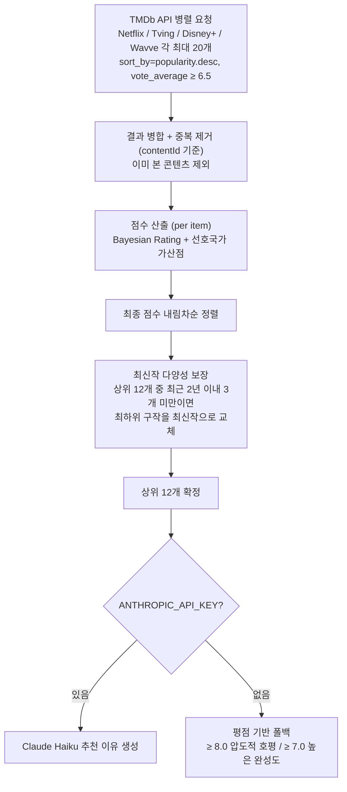

# HONGCHA — OTT 콘텐츠 추천 서비스

> 넷플릭스, 티빙, 디즈니+, 웨이브에서 지금 볼 만한 콘텐츠를 큐레이션해드립니다.

## Features

- 드라마 · 영화 · 예능 · 다큐멘터리 카테고리별 탐색
- OTT 플랫폼 필터 (Netflix / Tving / Disney+ / Wavve)
- 선호국가 필터 (한국 · 일본 · 중국 · 영미권 · 그외) — 다중선택, 가산점 방식
- 출시 연도 범위 슬라이더 필터
- AI 기반 추천 이유 (Claude Haiku + TMDb 평점 근거 폴백)
- "봤어요" 체크 → 본 콘텐츠 제외 후 재추천
- "안볼래요" → 현재 목록에서 즉시 제거
- 쿠키 기반 세션으로 설정 자동 저장

## Recommendation Algorithm

### 점수 공식

**① Bayesian Rating** — 투표 수가 적은 콘텐츠의 평점 과대평가를 보정

$$S_{\text{bayes}} = \frac{v}{v + m} \cdot R + \frac{m}{v + m} \cdot C$$

| 변수 | 의미 | 값 |
|------|------|----|
| $v$ | 투표 수 (`vote_count`) | TMDb 실측값 |
| $R$ | 평균 평점 (`vote_average`) | TMDb 실측값 |
| $m$ | 신뢰 기준 최소 투표 수 | 200 |
| $C$ | 전체 사전 평균 | 7.0 |

- $v \gg m$ → $S_{\text{bayes}} \approx R$ (실제 평점 신뢰)
- $v \ll m$ → $S_{\text{bayes}} \approx C = 7.0$ (평범한 작품으로 수렴)

**② 선호국가 가산점**

$$S_{\text{lang}} = \begin{cases} 1.5 & \text{if } \mathrm{original\_language} \in \text{선호국가} \\ 0 & \text{otherwise} \end{cases}$$

**③ 최종 점수**

$$S = S_{\text{bayes}} + S_{\text{lang}}$$

---



### 선호국가 가산점 상세

| 설정값 | 해당 조건 |
|--------|-----------|
| 🇰🇷 한국 | `original_language == "ko"` |
| 🇯🇵 일본 | `original_language == "ja"` |
| 🇨🇳 중국 | `original_language == "zh"` |
| 🇺🇸 영미권 | `original_language == "en"` |
| 🌍 그외 | ko · ja · zh · en 이외 모든 언어 |

선호국가를 복수 선택하면 **그 중 하나라도 일치하면** +1.5점 적용됩니다.

## Tech Stack

| Layer | Technology |
|-------|-----------|
| Framework | Next.js 16 (App Router) |
| UI | shadcn/ui · Tailwind CSS |
| Database | Neon PostgreSQL · Drizzle ORM |
| Content API | TMDb API v3 |
| AI Reasoning | Anthropic Claude Haiku (optional) |

## Getting Started

### Prerequisites

- Node.js 20+
- TMDb API 키 ([발급](https://www.themoviedb.org/settings/api))
- Neon PostgreSQL 프로젝트 ([생성](https://neon.tech))
- Google OAuth 앱 ([생성](https://console.cloud.google.com) → API 및 서비스 → 사용자 인증 정보)
- Anthropic API 키 ([발급](https://console.anthropic.com)) — 없으면 평점 기반 폴백 동작

### Installation

```bash
npm install
cp .env.example .env.local
# .env.local에 아래 환경변수 입력
npx drizzle-kit push   # DB 스키마 생성
```

### Environment Variables

```
TMDB_API_KEY=           # 필수 — TMDb API 키
DATABASE_URL=           # 필수 — Neon PostgreSQL Connection String
AUTH_SECRET=            # 필수 — npx auth secret 으로 생성
GOOGLE_CLIENT_ID=       # 필수 — Google OAuth 클라이언트 ID
GOOGLE_CLIENT_SECRET=   # 필수 — Google OAuth 클라이언트 시크릿
ANTHROPIC_API_KEY=      # 선택 — 없으면 평점 기반 폴백
```

### Run

```bash
npm run dev   # 개발 서버 (http://localhost:3000)
npm run build # 프로덕션 빌드
npm start     # 프로덕션 서버
```

## License

MIT
